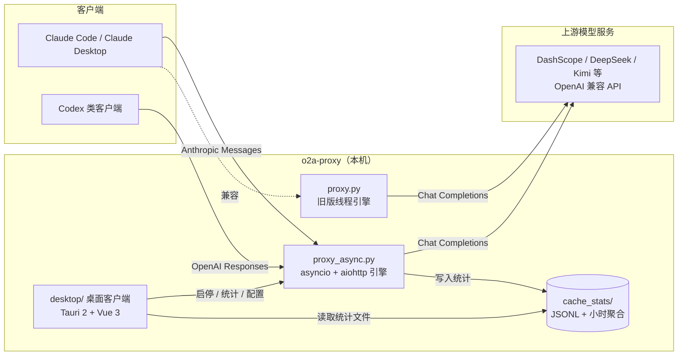

# o2a-proxy

Anthropic → OpenAI 协议转换代理：把 Claude Code / Claude Desktop 发出的 Anthropic Messages API 请求转换为 OpenAI 兼容格式，转发给 DashScope、DeepSeek、Kimi 等国内模型服务；同时支持 OpenAI Responses → Chat Completions 的透传（codex 模式，可接 Codex 类客户端）与 Anthropic 原生透传（direct 模式，直连 Anthropic 协议端点）。

## 特性

- **协议转换**：Anthropic Messages API → OpenAI Chat Completions；OpenAI Responses → Chat（codex 模式）；Anthropic 原生透传（direct 模式）
- **流式响应**：完整支持 SSE 流式输出，thinking / tool_calls / usage 逐段透传
- **异步引擎**：asyncio + aiohttp，单进程多服务、连接池复用、客户端断连即取消上游
- **多服务配置**：`config.json` 支持任意数量服务，每服务独立端口、独立启停
- **费用与缓存统计**：JSONL 原始记录 + 小时聚合，命中率 / 覆盖率 / 费用估算
- **桌面客户端**（`desktop/`）：托盘图标 + 右键菜单、悬浮看板、统计图表、配置管理、模型列表联想、深/浅主题，跨平台（Windows / macOS / Linux）
- **兼容旧版**：`proxy.py`（线程版引擎）仍可运行

## 架构



### 组件说明

| 组件 | 说明 |
|---|---|
| `proxy_async.py` | **推荐引擎**：单进程 asyncio 事件循环承载所有服务端口，aiohttp 连接池复用上游连接，流式请求不占线程，客户端断开立即取消 |
| `proxy.py` | 旧版线程引擎（`ThreadingHTTPServer` + urllib），保留兼容，功能与新引擎一致 |
| `desktop/` | Tauri 2 + Vue 3 桌面客户端：托盘启停、悬浮看板、统计面板、配置编辑器、模型列表联想 |
| `cache_stats/` | 统计数据：`YYYY-MM-DD.jsonl`（原始记录）+ `summary/<服务>/YYYY-MM-DD.json`（小时聚合） |
| `pricing.json` | 模型定价数据，用于费用估算 |
| `cache-stats.py` | 命令行统计查看工具 |

## 安装

### 1. 代理引擎（Python 3.10+）

```bash
pip install -r requirements.txt
cp config.example.json config.json
# 编辑 config.json 填入真实 API Key
python proxy_async.py
```

也可以使用环境变量兜底（无 `config.json` 时，单服务）：

```bash
export DASHSCOPE_API_KEY=sk-xxx
export DASHSCOPE_URL=https://dashscope.aliyuncs.com/compatible-mode/v1/chat/completions
export PROXY_PORT=11011
python proxy_async.py
```

### 2. 桌面客户端（推荐）

前置：Node.js 18+、pnpm、Rust 工具链；Windows 另需 VS Build Tools（C++）与 WebView2（Win10 20H2+ 自带）。

```bash
cd desktop
pnpm install
pnpm tauri dev      # 开发运行（托盘在系统托盘区）
pnpm tauri build    # 打包（Windows NSIS/MSI、macOS dmg）
```

客户端自动定位项目根目录（含 `proxy.py` 的目录），Python 路径可用 `O2A_PYTHON` 环境变量指定。

### 3. 配置 Claude Code

```bash
export ANTHROPIC_BASE_URL=http://127.0.0.1:11011
export ANTHROPIC_AUTH_TOKEN=your-auth-token
```

或写入 `~/.claude/settings.json`：

```json
{
  "env": {
    "ANTHROPIC_BASE_URL": "http://127.0.0.1:11011",
    "ANTHROPIC_AUTH_TOKEN": "your-auth-token"
  }
}
```

## 配置说明

```json
{
  "auth_token": "your-auth-token",
  "cache_stats_enabled": true,
  "cache_stats_dir": "cache_stats",
  "cache_stats_retention_days": 30,
  "services": [
    {
      "comment": "dashscope",
      "mode": "claude",
      "model": "qwen-plus",
      "sub_model": "qwen-plus",
      "listen_address": 11011,
      "openai_base_url": "https://dashscope.aliyuncs.com/compatible-mode/v1/chat/completions",
      "openai_api_key": "sk-your-api-key"
    }
  ]
}
```

| 字段 | 说明 |
|---|---|
| `auth_token` | 认证令牌（可选，建议生产启用） |
| `cache_stats_enabled` | 是否记录缓存统计 |
| `cache_stats_dir` | 统计目录；**留空默认 `<项目根>/cache_stats`**（应用所在位置的相对目录），显式填写时相对路径基于项目根解析 |
| `cache_stats_retention_days` | 统计保留天数 |
| `services[].comment` | 服务备注（客户端里作为服务名） |
| `services[].mode` | `claude`（Anthropic 转换）/ `codex`（OpenAI 透传）/ `direct`（Anthropic 原生透传） |
| `services[].model` | 主模型 |
| `services[].sub_model` | 子模型（Claude Code 子 agent / Task 工具使用） |
| `services[].listen_address` | 监听端口，每服务独立 |
| `services[].openai_base_url` | 上游 OpenAI 兼容 API 地址 |
| `services[].openai_api_key` | 上游 API Key |
| `services[].context_1m` | 1M 上下文模式（影响默认 `max_tokens`） |
| `services[].max_tokens` | 最大输出 token（缺省 4096） |

## 统计与费用

- **口径**：`缓存命中率 = 缓存读 / (缓存读 + 输入)`，对齐 Anthropic 官方定义
- **记录文件**：`cache_stats/YYYY-MM-DD.jsonl`（每次请求一条）
- **聚合文件**：`cache_stats/summary/<服务>/YYYY-MM-DD.json`（逐小时汇总，含费用）
- **命令行查看**：

```bash
python cache-stats.py day
```

- **桌面客户端**：统计页提供当前小时 / 今日 / 本月对比、逐小时 / 逐日图表、按模型分组统计、实时调用流，代理停止时历史数据仍可查看（直接读文件）。

> 费用为估算值，实际以平台账单为准。

## 支持平台

理论上支持所有 OpenAI 兼容的模型服务（DashScope、DeepSeek、Kimi、OpenAI 等），只需配置 `openai_base_url` 与 `openai_api_key`。

## 开发

```text
o2a-proxy/
├── proxy_async.py          # asyncio 引擎（推荐）
├── proxy.py                # 旧版线程引擎（兼容）
├── config.example.json     # 配置模板
├── pricing.json            # 模型定价
├── requirements.txt        # Python 依赖
├── cache-stats.py          # 命令行统计
├── desktop/                # Tauri 2 + Vue 3 桌面客户端
│   ├── src-tauri/          # Rust 后端（托盘 / 进程管理 / 统计聚合）
│   ├── src/                # Vue 前端（面板 / 悬浮窗 / 图表）
│   └── scripts/            # 图标生成等脚本
└── cache_stats/            # 统计数据（不提交）
```

测试：

```bash
cd desktop/src-tauri && cargo test   # Rust 单测（统计聚合 / 进程管理 / 模型列表）
python test_cache_stats.py           # 统计逻辑测试
```

## 常见问题

### Q: 为什么缓存命中率是 0？

部分模型不支持缓存，或请求内容没有重复。缓存命中率只在有缓存读时才有意义。

### Q: 如何切换模型？

修改 `config.json` 的 `model` / `sub_model` 后重启代理；桌面客户端里也可直接编辑并保存。

### Q: 模型列表怎么来的？

客户端按服务 API 地址请求 `…/models` 端点获取，同一地址缓存复用；仅用于输入联想，不影响实际转发。

## 安全说明

- **不要提交 `config.json`**：包含 API Key，已加入 `.gitignore`
- **建议启用 `auth_token`**：生产环境保护代理接口
- **限制访问**：默认只监听 `127.0.0.1`，不要暴露到公网

## 许可证

MIT License
