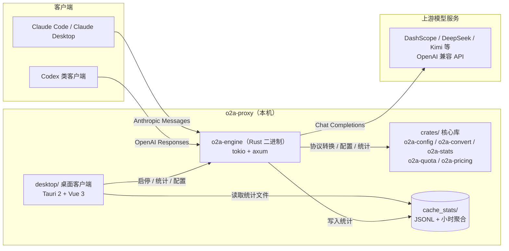

# o2a-proxy

Anthropic → OpenAI 协议转换代理：把 Claude Code / Claude Desktop 发出的 Anthropic Messages API 请求转换为 OpenAI 兼容格式，转发给 DashScope、DeepSeek、Kimi 等国内模型服务；同时支持 OpenAI Responses → Chat Completions 的透传（codex 模式，可接 Codex 类客户端）与 Anthropic 原生透传（direct 模式，直连 Anthropic 协议端点）。

## 特性

- **协议转换**：Anthropic Messages API → OpenAI Chat Completions；OpenAI Responses → Chat（codex 模式）；Anthropic 原生透传（direct 模式）
- **流式响应**：完整支持 SSE 流式输出，thinking / tool_calls / usage 逐段透传
- **Rust 引擎**：tokio + axum 单进程多端口、连接池复用、客户端断连即取消上游；单二进制发行，无 Python 运行时依赖
- **多服务配置**：`config.json` 支持任意数量服务，每服务独立端口、独立启停
- **多账号管理**：账号（API Key + OpenAI/Anthropic 端点）与服务分离，多服务可复用同一账号，账号级统计聚合
- **费用与缓存统计**：JSONL 原始记录 + 小时聚合，命中率 / 覆盖率 / 费用估算
- **桌面客户端**（`desktop/`）：托盘图标 + 右键菜单、悬浮看板、统计图表、配置管理、模型列表联想、深/浅/跟随系统主题、全局快捷键（Ctrl+Alt+O 面板 / Ctrl+Alt+F 悬浮窗），跨平台（Windows / macOS / Linux）
- **显式协议声明**：服务配置 `api` 字段声明入口协议（chat / responses / anthropic），消除自动识别误判

## 架构



### 组件说明

| 组件 | 说明 |
|---|---|
| `engine/` | **引擎二进制 `o2a-engine`**：单进程 tokio 事件循环承载所有服务端口，reqwest 连接池复用上游连接，客户端断开立即取消上游 |
| `crates/o2a-convert` | **协议转换**：Anthropic ↔ OpenAI Chat / Responses 互转、整包透传、思考深度映射、流式翻译器 |
| `crates/o2a-config` | **配置模型**：账号/服务体系、config.json / auth.json 加载与旧格式迁移、路径解析 |
| `crates/o2a-stats` | **缓存统计**：JSONL 记录 + 小时聚合 + 计费重放 + 账号归并 |
| `crates/o2a-quota` | **订阅额度**：适配器注册表（codex / openrouter / opencode-go / zai / local 等 8 个） |
| `crates/o2a-pricing` | **定价**：定价目录解析与费用计算（与桌面端共享同一实现，golden 对齐） |
| `desktop/` | Tauri 2 + Vue 3 桌面客户端：托盘启停、悬浮看板、统计面板、配置编辑器、模型列表联想 |
| `cache_stats/` | 统计数据：`YYYY-MM-DD.jsonl`（原始记录）+ `summary/<服务>/YYYY-MM-DD.json`（小时聚合） |
| `pricing.json` | 模型定价数据，用于费用估算（支持按账号覆盖，见下文） |
| `auth.json` | API Key 独立存放（可选） |

## 安装

### 1. 代理引擎（Rust 二进制，无运行时依赖）

```bash
cargo build -p o2a-engine --release
cp config.example.json config.json
cp auth.example.json auth.json   # API Key 放这里，config.json 不存 Key
# 编辑 auth.json 填入各账号 API Key；编辑 config.json 填账号端点与服务
./target/release/o2a-engine
```

也可以使用环境变量兜底（无 `config.json` 时，单服务）：

```bash
export DASHSCOPE_API_KEY=sk-xxx
export DASHSCOPE_URL=https://dashscope.aliyuncs.com/compatible-mode/v1/chat/completions
export PROXY_PORT=11011
./target/release/o2a-engine
```

### 2. 桌面客户端（推荐）

前置：Node.js 18+、pnpm、Rust 工具链；Windows 另需 VS Build Tools（C++）与 WebView2（Win10 20H2+ 自带）。

```bash
cd desktop
pnpm install
pnpm tauri dev      # 开发运行（托盘在系统托盘区）
pnpm tauri build    # 打包（Windows NSIS/MSI、macOS dmg）
```

> **同时运行两个实例**：已移除单实例限制，可同时启动正式版 `o2a-desktop.exe` 与开发版 `pnpm tauri dev`，方便一边使用一边改代码。在 `desktop/` 下执行 `pnpm dev:dual` 可一键先启动正式版、再启动开发版。两个实例共用同一份 `config.json` / 统计数据，代理端口也相同，实际使用时只让其中一个实例启动代理，避免端口冲突。

客户端自动定位项目根目录，并优先 spawn `o2a-engine` 二进制（解析顺序：`O2A_ENGINE` 环境变量 > 项目根 > 桌面端可执行文件同目录 > `target/release/`）；找不到二进制时回退旧 Python 引擎（过渡期兼容）。

### 3. 配置 Claude Code

```bash
export ANTHROPIC_BASE_URL=http://127.0.0.1:11011
export ANTHROPIC_AUTH_TOKEN=your-auth-token
```

或写入 `~/.claude/settings.json`：

```json
{
  "env": {
    "ANTHROPIC_BASE_URL": "http://127.0.0.1:11011",
    "ANTHROPIC_AUTH_TOKEN": "your-auth-token"
  }
}
```

## 配置说明

### 配置文件位置（默认与可指定）

**默认位置**：`config.json` 与 `auth.json` 均读取**项目根目录**（即与 `proxy.py` 同目录，Windows/macOS 完全一致，不区分平台）。桌面客户端同样以该目录为准（通过 `O2A_ROOT` 环境变量或自动向上查找含 `proxy.py` 的目录定位项目根）。

**指定其他位置**（多环境 / 绿色部署 / 不想把配置放进代码目录时），支持环境变量与命令行参数，优先级：命令行参数 = 环境变量 > 默认项目根：

| 方式 | 说明 |
|---|---|
| `O2A_CONFIG` 环境变量 | 指定 `config.json` 路径；指向目录时取目录下 `config.json` |
| `O2A_AUTH` 环境变量（可选） | 指定 `auth.json` 路径；**不设置时自动跟随 config.json 所在目录**，整套配置一起迁移 |
| `o2a-engine --config <路径|目录> [--auth <路径|目录>]` | 命令行指定（写入等价环境变量） |

**桌面客户端**还可在「配置」页的「配置文件位置」卡片直接设置（路径输入 + 「浏览文件/浏览目录」系统原生选择器 + 应用位置 / 恢复默认）：
该设置保存在系统用户配置目录（Windows `%APPDATA%\com.o2aproxy.desktop\settings.json`，macOS `~/Library/Application Support/com.o2aproxy.desktop/settings.json`），
优先级低于环境变量；桌面端启动代理子进程时会把生效位置传给引擎，两端读写同一份配置。

示例（把配置放到独立目录）：

```bash
# 方式一：环境变量（引擎 / 桌面端通用）
export O2A_CONFIG=/etc/o2a-proxy/config.json
export O2A_AUTH=/etc/o2a-proxy/auth.json   # 可选，默认跟随 config 目录
o2a-engine

# 方式二：命令行参数
o2a-engine --config /etc/o2a-proxy/config.json --auth /etc/o2a-proxy/auth.json
```

> 桌面客户端读取自身进程环境的 `O2A_CONFIG`/`O2A_AUTH`，并在启动代理子进程时继承传递，两端读写同一份配置。

```json
{
  "auth_token": "your-auth-token",
  "cache_stats_enabled": true,
  "cache_stats_dir": "data/cache_stats",
  "cache_stats_retention_days": 30,
  "accounts": [
    {
      "id": "acc-1",
      "name": "DashScope",
      "openai_url": "https://dashscope.aliyuncs.com/compatible-mode/v1/chat/completions",
      "anthropic_url": ""
    }
  ],
  "services": [
    {
      "comment": "dashscope",
      "account": "acc-1",
      "client": "anthropic",
      "model": "qwen-plus",
      "override_model": true,
      "listen_address": 11011
    }
  ]
}
```

> **Key 默认不写入 `config.json`**：账号 API Key 放在 `auth.json`（见下文）。`accounts[].api_key` 仅作为旧配置兼容保留，新配置不写。

| 字段 | 说明 |
|---|---|
| `auth_token` | 认证令牌（可选，建议生产启用） |
| `cache_stats_enabled` | 是否记录缓存统计 |
| `cache_stats_dir` | 统计目录；**留空默认 `<项目根>/data/cache_stats`**（应用所在位置的相对目录），显式填写时相对路径基于项目根解析 |
| `cache_stats_retention_days` | 统计保留天数 |
| `accounts[].id` | 账号唯一 id（服务引用它，自动生成不可改） |
| `accounts[].name` | 账号显示名 |
| `accounts[].api_key` | 账号 API Key（**旧配置兼容字段，新配置默认不写**，改放 `auth.json`） |
| `accounts[].openai_url` | OpenAI 兼容端点（**base 或完整 chat/completions 地址均可**：`https://api.deepseek.com`、`…/v1`、`…/chat/completions` 都会归一化为完整 chat/completions 地址） |
| `accounts[].anthropic_url` | Anthropic 兼容端点（如 `https://api.anthropic.com/v1/messages`，可留空） |
| `services[].comment` | 服务备注（客户端里作为服务名） |
| `services[].account` | 引用的账号 id |
| `services[].api` | **入口协议（推荐显式声明）**：`openai-completions`（pi/常规 Chat）/ `openai-responses`（Codex）/ `anthropic-messages`（Claude Code）；未声明时回退 `client`/自动识别（旧配置兼容）。账号级 `accounts[].api` 可作为该账号所有服务的默认值 |
| `services[].upstream_api` | **上游原生协议**（配合 `api=openai-responses`）：`openai-completions`（默认，上游只支持 Chat → 转换）/ `openai-responses`（上游原生支持 Responses，如 DeepSeek 官方 → 整包透传零转换） |
| `services[].client` | 客户端类型（旧字段，`api` 未声明时生效）：`anthropic`（Claude Code）/ `openai`（Codex）/ `auto`（按请求自动识别，默认） |
| `services[].model` | 模型（默认覆盖客户端请求的模型） |
| `services[].override_model` | **模型覆盖开关**（默认 `true`）：`true` 时所有请求一律使用服务配置的 `model`（忽略客户端请求里的模型名）；`false` 时忠实透传客户端请求的模型名（缺省才回退服务配置）。`false` 适合客户端自己选模型（如 opencode / pi / hermes 各自指定主、子 agent 模型）的场景 |
| `services[].listen_address` | 监听端口，每服务独立 |
| `services[].context_1m` | 1M 上下文模式（影响默认 `max_tokens`） |
| `services[].max_tokens` | 最大输出 token（缺省 4096） |
| `services[].thinking_mode` | **思考深度透传模式**（默认 `auto`）：`auto`（按上游 URL/模型自动推断）/ `passthrough`（Anthropic 风格 `thinking` 对象原样透传，DeepSeek V3.2 / Kimi K2 / 兼容网关）/ `effort`（`budget_tokens` → `reasoning_effort` 档位，OpenAI 标准）/ `enable_thinking`（布尔开关，DashScope/Qwen 兼容模式）/ `none`（不透传）。见下文「思考深度透传」 |
| `services[].pricing` | **计价模式**（可选，默认按 `pricing.json` 计费）：`none` 表示订阅制（如 opencode token/code plan），按 token 计价无意义——统计记录 cost 恒为 0，桌面端统计面板/热力图隐藏费用展示，仅保留请求数与 token 用量 |

> **兼容**：旧格式（`services[].openai_base_url` / `openai_api_key` 内嵌，`mode` 字段）读取时自动迁移为账号结构，无需手动改配置。

### 思考深度透传（thinking_mode）

客户端请求里的"思考深度"参数按入口协议有两种形态：Anthropic 的 `thinking: {type, budget_tokens}`（token 预算）与 OpenAI 的 `reasoning: {effort}` / `reasoning_effort`（low/medium/high 档位）。两者不同构（预算 vs 档位），代理按服务级 `thinking_mode` 映射到上游：

| thinking_mode | 上游收到的参数 | 适用上游 |
|---|---|---|
| `auto`（默认） | 按上游 URL/模型名推断：dashscope/qwen → `enable_thinking`；deepseek/kimi/moonshot → `thinking` 原样（含 `budget_tokens`）；其他 OpenAI 兼容网关 → `reasoning_effort` | 无需配置，覆盖主流 |
| `passthrough` | `thinking: {type, budget_tokens}` 原样透传 | DeepSeek V3.2 / Kimi K2 Thinking / 接受 Anthropic 风格 thinking 的中转网关 |
| `effort` | `reasoning_effort`（`budget_tokens` ≥8192 → high，≥2048 → medium，其余 → low；enabled 无预算时 medium 兜底） | OpenAI 标准档位的端点 |
| `enable_thinking` | `enable_thinking: true/false` | DashScope / Qwen 兼容模式 |
| `none` | 不透传（模型默认行为） | — |

各入口 × 上游组合的处理方式：

| 入口 | 上游 | 思考深度处理 |
|---|---|---|
| `anthropic-messages` | OpenAI Chat | 按 thinking_mode 转换（上表） |
| `anthropic-messages` | Anthropic（direct 透传） | **整包透传**，`thinking` 原样保留 |
| `openai-responses` | OpenAI Chat | `reasoning: {effort}` / `reasoning_effort` → 按 thinking_mode 转换 |
| `openai-responses` | Responses（整包透传） | **原样保留** |
| `openai-completions` | OpenAI Chat | **整包透传**，`reasoning_effort` 等字段原样保留 |

> 思考**内容**（上游 `reasoning_content` → Anthropic `thinking` 块 / Responses `reasoning` item）与推理 token 统计（`reasoning_tokens`）已在响应方向完整透传，不受 `thinking_mode` 影响。

### 入口协议（api 字段，推荐显式声明）

不同客户端使用不同协议：pi 常规用 `openai-completions`（Chat）、Codex 新 CLI 用 `openai-responses`、Claude Code 用 `anthropic-messages`。在服务上显式声明 `api` 后不再做请求体猜测（自动识别在部分客户端下不可靠）：

```json
{
  "services": [
    { "comment": "pi 直连", "account": "acc-3", "api": "openai-completions", "model": "deepseek-v4-flash", "listen_address": 11012 },
    { "comment": "Claude Code", "account": "acc-2", "api": "anthropic-messages", "model": "claude-4", "listen_address": 11013 }
  ]
}
```

| api 值 | 入口 | 行为 |
|---|---|---|
| `openai-completions` | Chat Completions | **整包透传**（请求/响应零转换，直连上游，仅缺 model 时注入服务配置） |
| `openai-responses` + `upstream_api: openai-responses` | Responses | **整包透传**（上游原生支持 Responses，如 DeepSeek 官方 `/v1/responses`，零转换） |
| `openai-responses`（默认 upstream=chat） | Responses | 转 Chat 发送上游，响应转回 Responses 事件 |
| `anthropic-messages` | Anthropic Messages | 账号有 anthropic 端点 → 透传（direct）；只有 openai 端点 → 转换发送（claude） |
| 未声明 | — | 回退旧 `client` 字段；无 client 时按请求自动识别（兼容旧配置） |

> **developer 角色规范化**：Chat/Responses 整包透传前，会把 OpenAI 特有的 `developer` 角色统一降级为 `system`（chat 的 `messages` 与 responses 的 `input` 消息项都会处理）。多数非 OpenAI 上游（DeepSeek / Kimi / Qwen 等）的角色枚举不含 `developer`（DeepSeek 只认 `system / user / assistant / tool` 等），不降级会直接 400（典型报错：`unknown variant developer`）。`system` 是所有上游都接受的通用角色，语义与 OpenAI 换名前的发送方式一致，且不影响 `reasoning_effort` / `thinking` 等字段；未含 developer 角色时请求体保持字节级原样透传。

> **模型列表拿不到协议**：`/models` 接口只返回模型 id，不含协议类型（同一中转账号下三种协议的模型可能并存），所以协议必须在配置中显式声明——这正是 pi 中 `provider.api` 的做法。桌面客户端「服务配置」里也已提供 `api` 下拉。

### Codex 接入（Responses 协议）

Codex CLI 通过 **Responses API** 与模型交互（`wire_api = "responses"`），且 **DeepSeek 官方原生支持 Responses**（`base_url = https://api.deepseek.com`）。两种接入方式：

**A. Codex → DeepSeek 官方（零转换透传，推荐）**：上游原生支持 Responses，配 `upstream_api: "openai-responses"` 直接透传：

```json
{
  "services": [
    { "comment": "codex-ds", "account": "acc-3", "api": "openai-responses", "upstream_api": "openai-responses", "model": "deepseek-v4-flash", "listen_address": 11013 }
  ]
}
```

Codex 侧 `~/.codex/config.toml`（参考 DeepSeek 官方接入文档，仅把 base_url 指向 o2a）：

```toml
model = "deepseek-v4-flash"
model_provider = "o2a-ds"
[model_providers.o2a-ds]
name = "o2a-ds"
base_url = "http://127.0.0.1:11013"
wire_api = "responses"
experimental_bearer_token = "qs-cc"
```

**B. Codex → 中转（仅支持 Chat，如 opencode.ai）**：默认 `upstream_api` 即可，o2a 自动做 Responses→Chat→Responses 转换：

```json
{ "comment": "codex-oc", "account": "acc-2", "api": "openai-responses", "model": "deepseek-v4-flash-free", "listen_address": 11014 }
```

> 同一账号可开多个服务（不同端口）分别服务不同客户端协议：pi 用 `openai-completions`（透传）、Codex 用 `openai-responses`（透传或转换）、Claude Code 用 `anthropic-messages`。

> **兼容**：旧格式（`services[].openai_base_url` / `openai_api_key` 内嵌，`mode` 字段）读取时自动迁移为账号结构，无需手动改配置。

### 密钥独立存放（auth.json，推荐）

对齐 pi 的 `auth.json` 模式：敏感 API Key 默认不写入 `config.json`，统一放 `auth.json`，键可为账号 `id` 或 `name`（值支持 `{type, key}` 或纯字符串），已加入 `.gitignore`：

```json
{
  "acc-1": { "type": "api_key", "key": "sk-your-api-key" },
  "oc-zen": { "type": "api_key", "key": "public" }
}
```

**加载优先级（向后兼容）：** `auth.json`（按 id → name） > `config.json` 的 `accounts[].api_key` > 旧 `services[].openai_api_key` 内嵌。`auth.json` 不存在或账号缺失时无缝回退旧配置，零破坏迁移。桌面客户端保存配置时也会自动把账号 Key 分流写入 `auth.json`，`config.json` 保持不含 Key。

### 模型价格按账号配置（pricing.json 的 accounts 段）

不同账号同一模型价格可能不同（如免费中转 vs 官方付费）。在 `pricing.json` 顶层加 `accounts` 段即可覆盖，键可为账号 `id` 或 `name`，结构与全局模型一致（`tiers[]`，CNY/百万 token）：

```json
{
  "accounts": {
    "acc-2": {
      "models": {
        "deepseek-v4-flash-free": { "tiers": [{ "input": 0, "output": 0 }] }
      }
    },
    "acc-3": {
      "models": {
        "deepseek-v4-flash": { "tiers": [{ "input": 1, "output": 2, "cache_hit": 0.02, "cache_miss": 1 }] }
      }
    }
  },
  "deepseek": { "models": { "deepseek-v4-flash": { "tiers": [{ "input": 1, "output": 2 }] } } }
}
```

**查找优先级：** `pricing.json["accounts"][账号 id/name][模型]` > 全局按模型名（provider 段）。未配置时价格为 0，与旧行为一致。计费同时生效于代理引擎与桌面统计面板（历史记录读取时按当前定价重算）。

### 订阅额度（OpenCode Go / ChatGPT Codex / GLM / OpenRouter）

订阅制服务（`services[].pricing` 为 `"none"` 或 `{"mode": "subscription"}`）不按 token 计费，
统计页费用卡自动隐藏，并改为在 **同一处** 展示该账号的订阅消耗 / 余量：

- 单个服务选中时：服务所属账号的额度卡直接显示在 KPI 下方；
- 「全部」视图时：所有订阅账号的额度卡集中成一张「订阅额度」网格，不再需要逐个服务切换。

额度数据由引擎 `GET /quota?account=<账号id>` 统一提供，支持以下适配器：

| 适配器 | 自动识别 / 显式 `quota_source` | 取数方式 | 展示窗口 |
|---|---|---|---|
| `opencode-go` | 域名 `opencode.ai` / `opencode-go` | 账号端点 `{base}/usage`（实际网关返回 rolling/weekly/monthly）；Cookie + 工作区页兜底 | rolling / weekly / monthly |
| `codex` | 域名 `chatgpt.com` / `codex`、`gpt`、`openai-codex` | `chatgpt.com/backend-api/wham/usage`（OAuth） | 5h 滚动 / 每周 / 余额 |
| `zai` | 域名 `bigmodel.cn`、`z.ai` / `glm-coding-plan` | 供应商 balance / plan 接口 | 余额 |
| `openrouter` | 域名 `openrouter.ai` / `openrouter` | `/api/v1/key` 或 credits | 余额 |
| `local` / `local-rolling-5h` | 默认 / 任意 | 本地 JSONL 聚合 | 请求数 / token 窗口 |

OpenCode Go 与 ChatGPT/Codex 都是订阅 OAuth 会话，平台没有公开的“API Key → 用量”接口。
可在账号配置里提供额度源（手动编辑 `config.json` 的 `accounts[].quota`）：

```json
{
  "accounts": [
    {
      "id": "acc-ocgo",
      "name": "OpenCode Go",
      "openai_url": "https://opencode.ai/zen/go/v1",
      "quota_source": "opencode-go",
      "quota": {
        "cookie": "auth=fe26...; oc_locale=zh",
        "workspace_id": "wrk_0123...",
        "url": "https://api.opencode.ai"
      }
    },
    {
      "id": "acc-chatgpt",
      "name": "ChatGPT Codex",
      "openai_url": "https://chatgpt.com/backend-api",
      "quota_source": "codex",
      "quota": {
        "token_file": "~/.codex/auth.json"
      }
    }
  ]
}
```

`codex` 适配器还可直接使用 `quota.access_token` / `quota.refresh_token`；`token_file` 支持
Codex CLI（`~/.codex/auth.json`）、pi（`~/.pi/agent/auth.json`）与 OpenCode
（`~/.local/share/opencode/auth.json`）三种常见的 OAuth 存储结构。额度查询失败会自动降级为
本地统计并标记 `stale`，不影响统计页与代理主流程。

### 转换矩阵（client × 账号端点）

| client | 账号只有 OpenAI 端点 | 账号只有 Anthropic 端点 | 双协议端点 |
|---|---|---|---|
| `anthropic`（Claude Code） | Anthropic→OpenAI 转换发送 | Anthropic 原生透传 | 透传 |
| `openai`（Codex） | Responses→Chat 透传 | **报错**（无 OpenAI 端点） | 透传 |
| `auto` | 按请求路径/格式自动识别 | 同左 | 同左 |

## 统计与费用

- **口径**：`缓存命中率 = 缓存读 / (缓存读 + 输入)`，对齐 Anthropic 官方定义
- **记录文件**：`cache_stats/YYYY-MM-DD.jsonl`（每次请求一条，路径由 `cache_stats_dir` 配置或 `CACHE_STATS_DIR` 环境变量决定）
- **聚合文件**：`cache_stats/summary/<服务>/YYYY-MM-DD.json`（逐小时汇总，含费用）
- **命令行查看**：`curl -H "Authorization: Bearer <token>" http://127.0.0.1:<port>/stats?period=day`

- **桌面客户端**：统计页提供当前小时 / 今日 / 本月对比、逐小时 / 逐日图表、按模型分组统计、实时调用流，代理停止时历史数据仍可查看（直接读文件）。「按模型过滤」作用于整页统计——KPI 卡、性能条（耗时 / 首字 / 速度）、图表序列、按服务拆分与实时调用流都会随所选模型收窄口径；下拉选项始终列出区间内全部模型。

> 费用为估算值，实际以平台账单为准。

## 支持平台

理论上支持所有 OpenAI 兼容的模型服务（DashScope、DeepSeek、Kimi、OpenAI 等），只需配置 `openai_base_url` 与 `openai_api_key`。

## 开发

```text
o2a-proxy/
├── engine/                  # o2a-engine 引擎二进制（tokio + axum）
├── crates/                  # 核心库
│   ├── o2a-config/          # 配置模型 / 路径解析 / 旧格式迁移
│   ├── o2a-convert/         # 协议转换（Anthropic ↔ OpenAI Chat / Responses）+ 流式翻译
│   ├── o2a-stats/           # 统计（JSONL / 聚合 / 计费重放）
│   ├── o2a-quota/           # 订阅额度适配器
│   └── o2a-pricing/         # 定价（与桌面端共享实现）
├── pricing/                 # 定价 golden fixtures（双端共享）
├── config.example.json      # 配置模板
├── pricing.json             # 模型定价
├── docs/rust-rewrite.md     # Rust 引擎实现文档（HTTP 契约 / 转换语义规约）
├── desktop/                 # Tauri 2 + Vue 3 桌面客户端
│   ├── src-tauri/           # Rust 后端（托盘 / 进程管理 / 统计聚合）
│   ├── src/                 # Vue 前端（面板 / 悬浮窗 / 图表）
│   └── scripts/             # 打包脚本（build-portable）
├── cache_stats/             # 统计数据（运行时生成，不提交）
└── logs/                    # 运行日志（运行时生成，不提交）
```

测试：

```bash
cargo test --workspace               # 引擎全量测试（转换矩阵 / 流式状态机 / 契约测试 / golden）
cd desktop/src-tauri && cargo test   # 桌面端 Rust 单测（进程管理 / 统计聚合 / 模型列表）
```

> 引擎契约测试用内置 mock 上游验证 SSE 事件序列与端点行为，不产生真实调用。

## 常见问题

### Q: 为什么缓存命中率是 0？

部分模型不支持缓存，或请求内容没有重复。缓存命中率只在有缓存读时才有意义。

### Q: 如何切换模型？

修改 `config.json` 的 `model` / `override_model` 后重启代理；桌面客户端里也可直接编辑并保存。

### Q: 模型列表怎么来的？

客户端按服务 API 地址请求 `…/models` 端点获取，同一地址缓存复用；仅用于输入联想，不影响实际转发。

## 安全说明

- **不要提交 `config.json`**：包含 API Key，已加入 `.gitignore`
- **建议启用 `auth_token`**：生产环境保护代理接口
- **限制访问**：默认只监听 `127.0.0.1`，不要暴露到公网

## 许可证

MIT License
